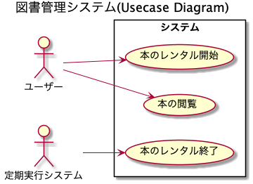
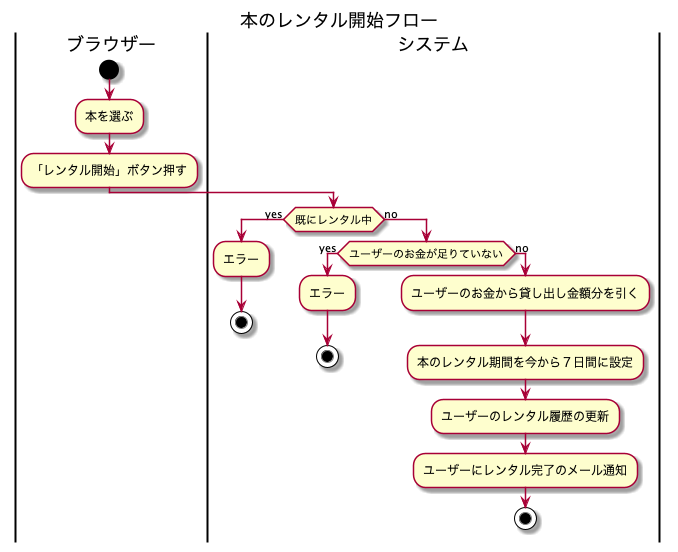
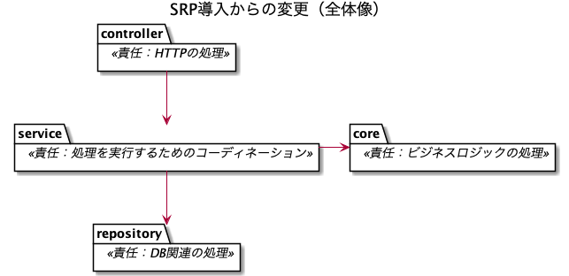
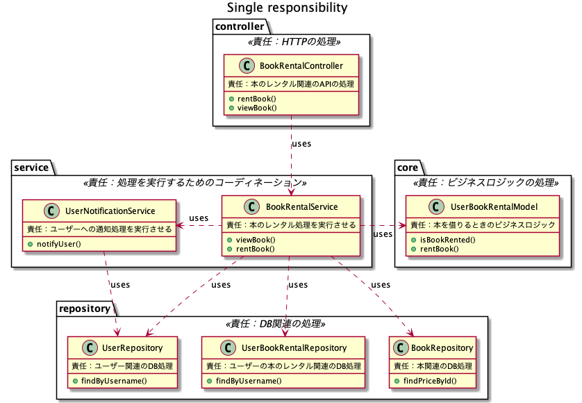

# SOLID原則の共有会

## 目的
下記の問題を解決するためにSOLIDの説明をします。

sub目的：モッピーへの共有資料作成
- SOLIDの説明のわかりやすさが知りたい

### 問題：技術選定をするときに最終的に採用するかの判断が難しい
原因：
- 判断する規準が無い
- 町田さんが言ってた規準が今無い

### 仮設
SOLIDはよく知られていて、良い基準になる

### 仮説検証方法
サンプルプロジェクトを実装してみる。  
ベーシックなSolutionにSOLIDデザイン原則をそれぞれ説明しながら一つづつ導入していく。  
結果的に良いコードになればSOLIDデザイン原則を町田さんの言ってた規準にする

## 仮説検証

### サンプルプロジェクトの紹介

### ベーシックなSolution
コードを見る

#### コードの特徴：開発時の観点
良いところ
- 総合的に開発時間が少ない
  - 設計を考えないでいい
- ファイル数が少ないのでポンコツEditorで開発可能(Emacsでもできる)

悪いところ　
- 手戻りリスクがある
- 切り分けて開発ができないため、全て一緒に開発する必用がある
  - ドメインロジック(一番大事なところ)
  - APIエンドポイント(作業)
  - DB設計(作業)
  - ドメインロジックのみのレビュー依頼とか出せない

#### コードの特徴：機能修正の観点
良いところ
- 一つのファイルを読むだけで良い

悪いところ
- コードが読みにくい
  - 手続きが羅列されていて、全体がわかりずらい
  - 処理が宣言的ではなく、手続き型なためコードを理解しないとなにが起きているのかわからない
- コードの再利用性が低い
  - クエリーとか再利用できそうだけどしてない

### Single Responsibility Principle (SRP)
日本語では「単一責任の原則」

原則：モジュールごとの責任を１つだけにするべし。  
この場合のモジュールは下記のようなものです。
- project
- class
- method

#### SRP導入の修正
SRPを導入したときの修正内容
- １ファイルで完結していたコードを複数のファイルに分ける。
- それぞれの新しくできたファイルの責任を一つだけにする。

これを導入したら一つだったファイルが複数に別れました。  

#### コードの特徴：開発時の観点
良いところ
- 手戻りリスクが減った
  - 切り分けて開発ができるため、一番重要なところだけ先に開発ができる
    - ビジネスロジック(最初に開発)
    - APIエンドポイント(ドメインロジックが決まってから開発)
    - DB設計(ドメインロジックが決まってから開発)
  - 手戻りがあるとしても大抵ビジネスロジックのみ
- 責任が一つだけだと自然と再利用性があがった
  - 再利用性を考えずにコードを書いても自然と再利用性が上がる

悪いところ
- 時間がかかる要因が増える
  - 責任をちゃんと考える必用がある
  - クラスが増える分、名付けてあげないといけない
- ファイル数が多いのでポンコツEditorでは開発しづらい

#### コードの特徴：機能修正の観点
良いところ
- 時間短縮
  - コードが読みやすい
    - 責任が一つだけのため、理解しやすい
  - 既存コードが再利用しやすい
  - 責任が一つだけなのでどこを修正すればいいかがすぐわかる

悪いところ
- Editor機能が無いと時間がかかる
  - 定義もとのコードへ飛ぶ
  - 使用箇所のコードへ飛ぶ

#### SRPの総合評価
いいね！

### Open-Closed Principle (OCP)
日本語で「開放/閉鎖原則」

原則：拡張できるようにすべし。変更

#### OCP導入の修正

